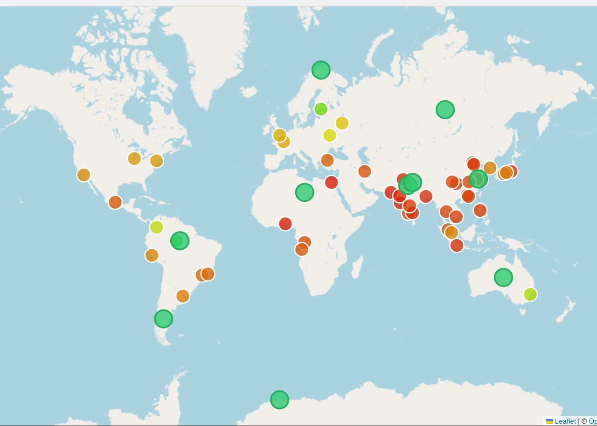

# Urban Planning Dashboard

Documentation for the dashboard built for **NASA Space Apps Challenge 2025**.

This site explains how to read and use the dashboard, what each piece of data on it means, and how it's put together. For install instructions and project background, see the [repo README](https://github.com/SAtyayu/nasa-challenge) — this site doesn't repeat that, it picks up from there.

## Start here

- New to the dashboard? Start with **[Reading the Map](guide-map.md)**.
- Looking for a specific field's meaning? Go to **[City Data Schema](ref-city-schema.md)** or **[Settlement Data Schema](ref-settlement-schema.md)**.
- Want to know what's real data vs. mocked? See **[Scope & Limitations](scope.md)**.
