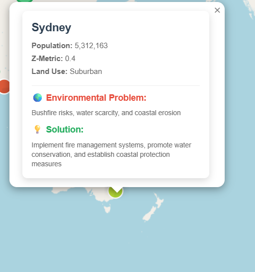

# Reading a City Card

Clicking any small city marker opens a card like this:

## What each field means

- **Population** — the city's population figure in the dataset.
- **Z-Metric** — the environmental risk score for this city, from 0 (lowest risk) to 1 (highest risk). See [The Z-Metric](ref-z-metric.md) for how this number is derived.
- **Land Use** — the city's land-use category (Urban, Rural, Suburban, Industrial, or Greenspace). This is also what the [land use filter](guide-filters.md) matches against.
- **Environmental Problem** — a specific issue this city faces (e.g. bushfire risk, water scarcity).
- **Solution** — a proposed response to that problem.

Every one of the 50 cities in the dataset follows this same five-field structure — see the [City Data Schema](ref-city-schema.md) for the underlying field names and types.

Next: [Reading a Settlement Card](guide-settlement-card.md)
