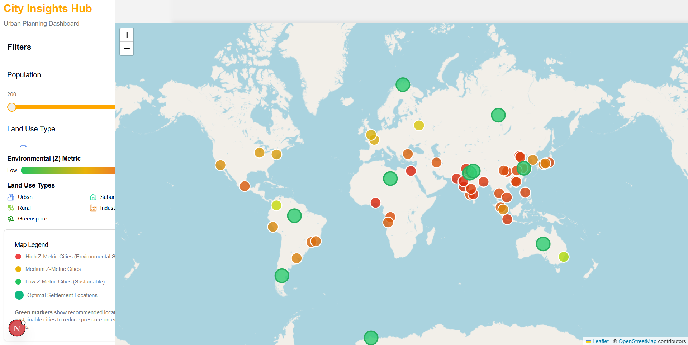

# Filtering Cities

The sidebar (left side of the dashboard) narrows down which cities are shown on the map.

## Available filters

- **Population** — slider; only cities at or above the selected population are shown.
- **Land Use Type** — toggle any combination of Urban, Rural, Suburban, Industrial, Greenspace. Only cities matching an active toggle are shown.
- **Environmental (Z) Metric** — slider along the low-to-high risk range; narrows cities to a Z-Metric band.

## Map Legend

The legend at the bottom of the sidebar is a reference, not a filter — it explains what each marker color means so you don't have to memorize it. See [Reading the Map](guide-map.md) for the same color key.

Next: [Reading a City Card](guide-city-card.md)
