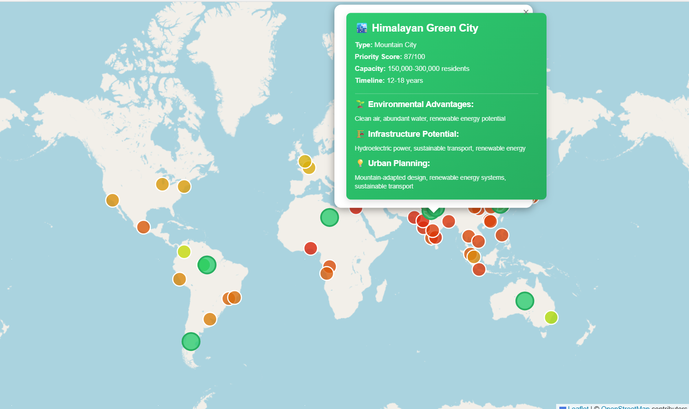

# Reading a Settlement Card

Clicking one of the 10 large green markers opens a settlement card instead of a city card:

## What each field means

- **Type** — the settlement archetype (e.g. Mountain City, Coastal City).
- **Priority Score** — a 0–100 ranking of how strong a candidate this location is.
- **Capacity** — the estimated resident range the settlement could support.
- **Timeline** — the rough development horizon, in years.
- **Environmental Advantages** — natural conditions favoring this site (e.g. clean air, abundant water).
- **Infrastructure Potential** — the kinds of infrastructure the location supports (e.g. hydroelectric power).
- **Urban Planning** — planning approach notes specific to the site's geography.

These 10 locations are a distinct dataset from the 50 cities — see [Settlement Data Schema](ref-settlement-schema.md) for the underlying fields, or [Scope & Limitations](scope.md) for how these candidates were selected.
